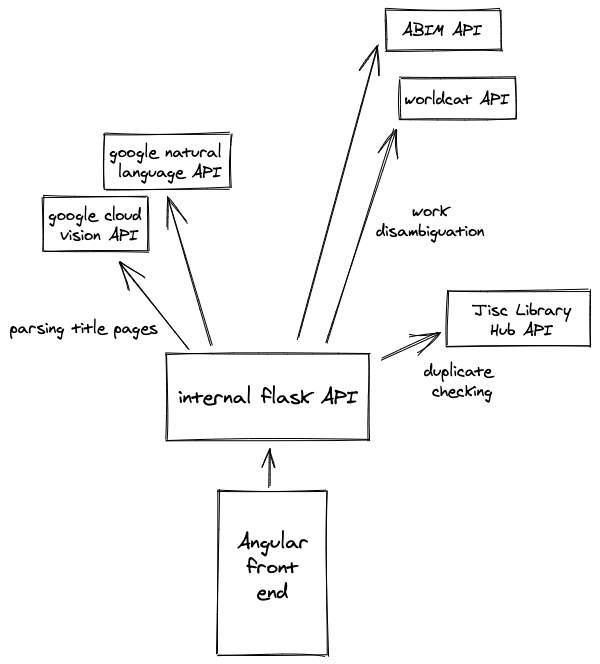

# Architecture

Rough description of the project's architecture

## Parsing title pages

Amplify takes an image uploaded by the user and runs it through google's _vision_ API, extracting visible text.

The text is then passed to google's _translate_ API, allowing the librarian to get a sense of the work's content if it's written in a non-english language or non-latin script.

The translated text is then passed to google's _natural language_ API, making a guess at the entities, people, places, etc which appear in the title page text.

## Work disambiguation

Through the amplify interface, the librarian can alter the data extracted from the title page if they notice any obvious misreadings or misunderstandings.

The parsed text is then formatted into a query for each of the third party catalogue APIs.

Currently we query:

- ABIM
- WorldCat
- Library Hub

Amplify has been written such that it should be straightforward to add further catalogue APIs to this list. See [third-party API documentation](./third_party_apis.md) for a longer list of available sources.

The librarian can then select from a list of suggested titles which plausibly match the query in external systems, and add any locally relevant information about the version in hand.

## Duplicate checking

Amplify can then check the Wellcome catalogue for existing copies of the work, avoiding the accessioning of duplicate works. We currently do this through JISC LibraryHub API.

Finally, assuming the work is going to be accessioned and more fully catalogued, it's possible to upload the minimal record to OCLC.
